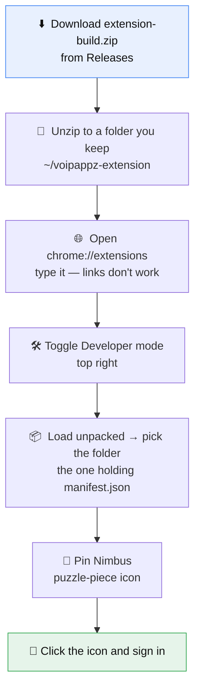

# VoIPAppz Chrome Extension

Screen pops, call state and agent availability, live in the browser.

## Install



[**Download the latest release →**](https://github.com/voipappz/chrome/releases/latest)

Chrome loads the extension *from* that folder every start — it does not copy it.
Move or delete the folder and the extension breaks.

### Two things that look like failures but aren't

- **Chrome asks at every start whether to keep it.** Deliberate: it's how Chrome
  stops extensions being installed behind your back. Applies to every unpacked
  extension. Choose keep.
- **A standing "disable developer mode extensions" warning.** Expected.

Both stop only for Web Store installs.

### If it doesn't work

| Symptom | Cause |
|---|---|
| No **Load unpacked** button | Developer mode is off |
| "Manifest file is missing or unreadable" | You picked the zip, or the wrong folder level — pick the one directly holding `manifest.json` |
| Gone after restarting Chrome | Folder moved or deleted, or the startup prompt was declined |
| No icon in the toolbar | Not pinned |

## Sign in

| Field | Value |
|---|---|
| **Domain** | Your node, e.g. `https://pbx.example.com` |
| **Username** | Your **user** email address |
| **Password** | That user's password |

Both of these return a generic `Invalid email or password`:

- **It's the user login, not your portal account** — different credential,
  different table. Admins: `make onboard` prints it as **Extension login**.
- **`+` in the address is rejected** before the password is even checked.

## Realtime feed

Sign-in works against any node serving `/auth/user_login`. Events additionally
need a NATS `websocket` listener, a `/nats` route at the edge, and a NATS user
matching the credential in `chrome/src/backgroundPage.ts`. **That user is not
configured yet** — the shared credential would need a wildcard
`notifications.>` subscribe, which is a cross-tenant read. Per-user scoping via
NATS `auth_callout` is the intended fix; until then the feed is inert.

## Develop

```bash
npm ci --legacy-peer-deps
npm run watch                                            # → angular/dist
NODE_OPTIONS=--openssl-legacy-provider npm run build:production
npm run test:e2e                                         # needs TEST_DOMAIN/USERNAME/PASSWORD
```

Load `angular/dist` unpacked. Background and content script changes need a
reload in `chrome://extensions`; popup changes don't. The legacy OpenSSL flag is
required on Node 17+ (webpack 4).

`angular/` is the popup UI, `chrome/src/` the background worker and content script.
